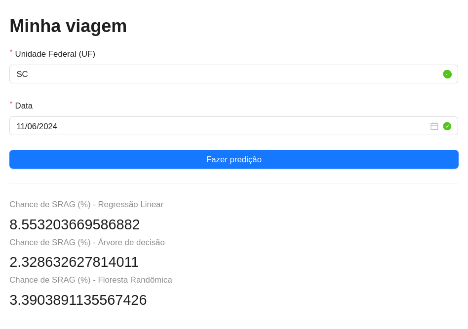

# Instruções
1. Rodar `pip install -r requirements.txt`
1. Rodar `learn.ipynb` completamente
1. Rodar `fastapi run api.py`
1. Rodar `npm run preview` dentro da pasta `/client`
1. Acessar [localhost:4173](http://localhost:4173)

# Gráficos
'

